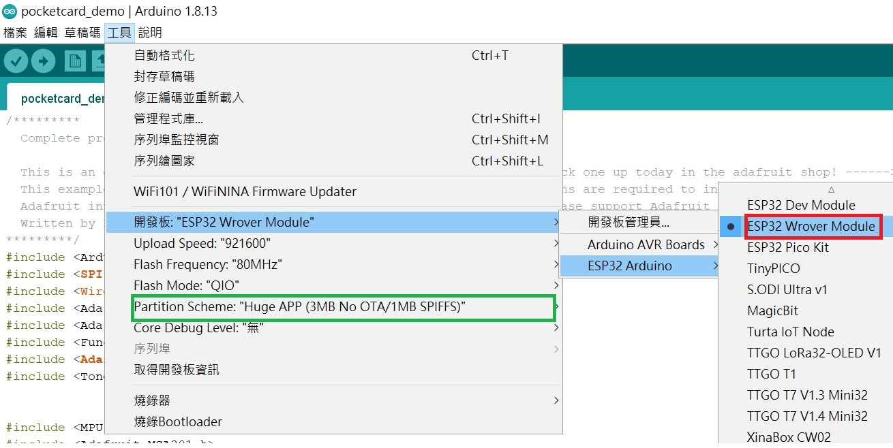
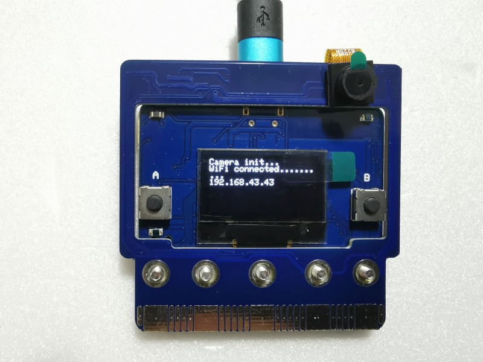
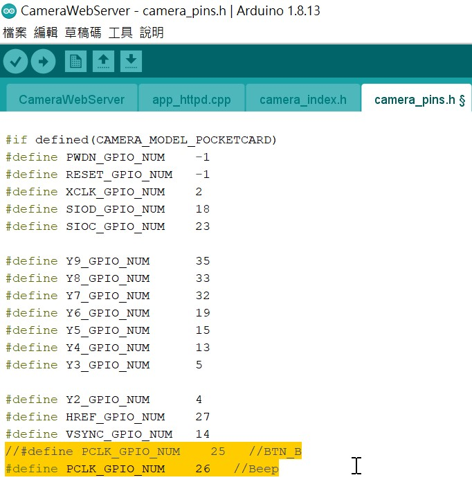

#  PocketCard Camera Extension Board

#### 1. 主板版本確認

- PocketCard  MPU9250的V1 版本沒有PSRAM 8MB，容量太小，所以會編譯不過

- PocketCard MPU9250的V2 版本，第一批生產時有2顆電容要解焊掉（紅框位置）才可以使用Camera 擴展板，其它批生產沒有這個問題，可以直接組裝

- PocketCard Lite 可以直接組裝

#### 2. 組裝

先按照 組裝影片 組裝好

<iframe width="560" height="315" src="https://www.youtube.com/embed/6ne-c_xRvqA" title="YouTube video player" frameborder="0" allow="accelerometer; autoplay; clipboard-write; encrypted-media; gyroscope; picture-in-picture" allowfullscreen></iframe>

#### 3. 燒錄程式

啟動 Arduino IDE ，開發板設定值「Partition Scheme」  請一定要選 「Huge APP」

打開範例的 「CameraWebServer」

設定 你自己的AP 的SSID 和 Password，再下載執行

#### 4. 執行測試

PocketCard Camera 若組裝和AP 設定沒有問題時，重新啟動成功時會出現如下畫面，畫面中出現的IP 就是PocketCard Camera 的IP 位置

使用手機或筆電的瀏覽器輸入上面的IP 位置，會出現下面WEBCAM 的設定畫面

按下「Start Stream」就會出現攝影畫面

#### 5. 其它注意事項

PocketCard Camera 使用的腳位很多，所以micro:bit Edge 那的腳位只剩下IIC 腳位可以應用，其它腳位使用完了。板載的感測器 **溫度,亮度A,亮度B** 可以使用，但 **按鈕A** 使用在 Camera 腳位，所以不能使用。**蜂鳴器** 和 **按鈕B** 也必順拿一個給 Camera 使用，所以使用指撥開關來做選擇，預設是把 **按鈕B** 給Camera 腳位使用，保留 **蜂鳴器** 功能。如果實做過程中要使用到 **按鈕 B**，請自行修改程式和指撥開關來更改設定。

指撥開關位置如下

出貨預設(保留 蜂鳴器功能，按鈕B 不能用)是 *指撥1 往下撥，指撥2 往上撥*，程式如下

如果要保留 按鈕B ，則蜂鳴器就不能用 ，請更改為 *指撥1 往上撥，指撥2 往下撥*，程式更改如下

再重新編譯上傳就行。

   

##### 網路上 PocketCard Camera 相關教學資料

[https://pocketcam.webnode.tw/](https://pocketcam.webnode.tw/?fbclid=IwAR1uM91wFPH5mFhdDiVRfL2HzsnaZH_8_qfdLWd2GFVZAnRUlsOI45761d8)

