# For Arduino

以下步驟適用

PocketCard 主板       （MPU9250 9軸版本）

PocketCard Lite 主板（MSA301 3軸版本）

#### 1. 先下載Arduino IDE工具： 

請至 https://www.arduino.cc/en/Main/Software 網站下載

#### 2. 安裝USB to UART 驅動程式

請至http://www.wch.cn/download/CH341SER_ZIP.html

安裝完驅動程式插入PocketCard，在裝置管理員中會出現新的COM 埠

  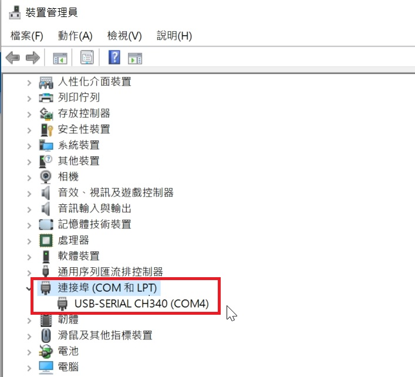

#### 3. 安裝ESP32核心檔案

啟動 Arduino IDE 並點擊下拉功能表「File」>「Preferences」。

  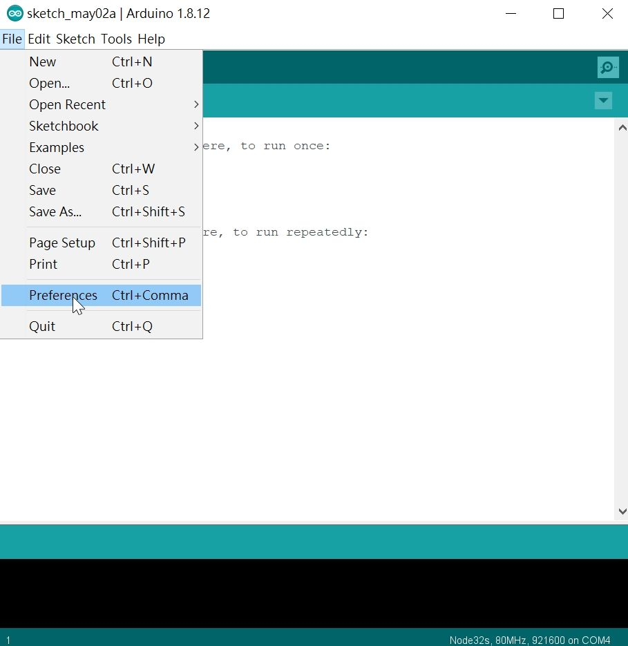

Additional Boards Manager URLs：

輸入 https://dl.espressif.com/dl/package_esp32_index.json

然後點擊「OK」鈕。

  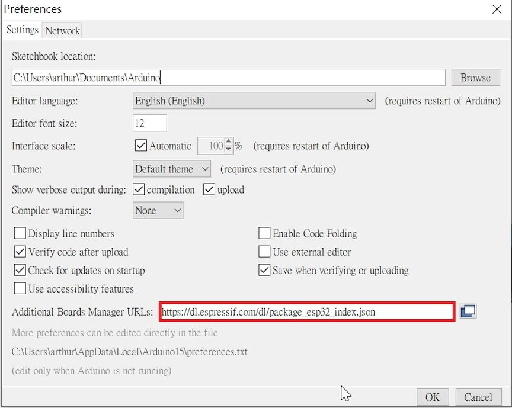

點擊下拉功能表「Tools」>「Board」>  「Board Manager...」

  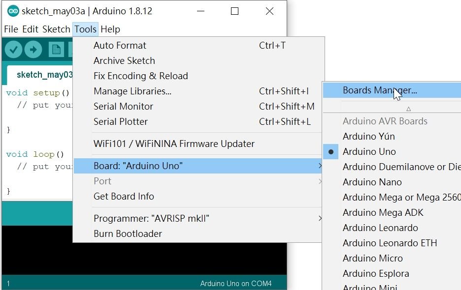

在 Type 右方空白欄位輸入「esp32」

點擊「Install」，然後等待幾分鐘下載完畢後點擊右下角落的「Close」鈕關閉視窗。 

  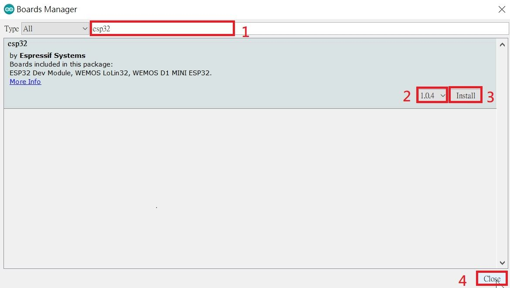

#### 4. 匯入 Libraries

請至https://github.com/kaise-ksrobot/pocketcard_arduino

點選Download ZIP 下載檔案

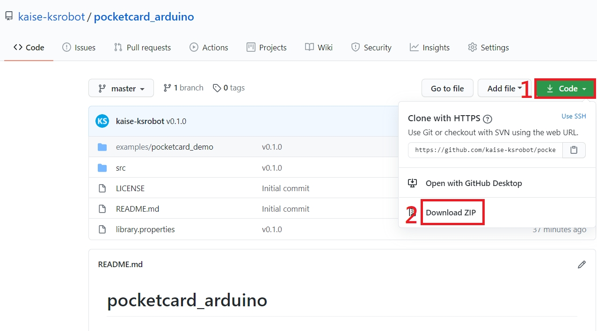

點擊下拉功能表「草稿碼」>「匯入程式庫」> 「加入.ZIP 程式庫」

  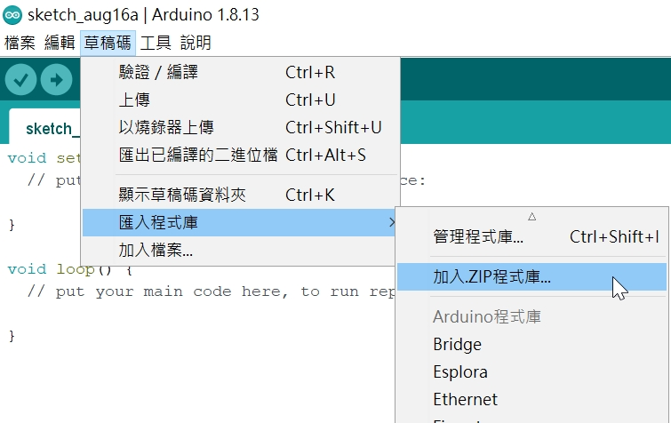

選 pocketcard_arduino-master.zip

  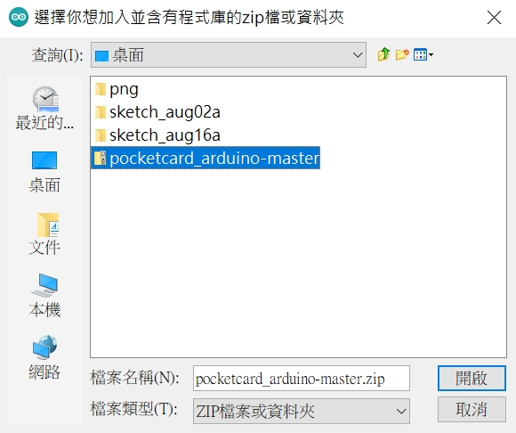

#### 5. 選擇 開發板和連接埠

點擊下拉功能表「Tools」>「Board」，

選擇「ESP32 Wrover Module」

開發板設定值可以用預設，但「Partition Scheme」  請改選 「Huge APP」

 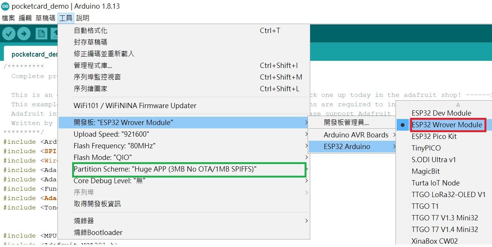

然後再選擇連接埠

  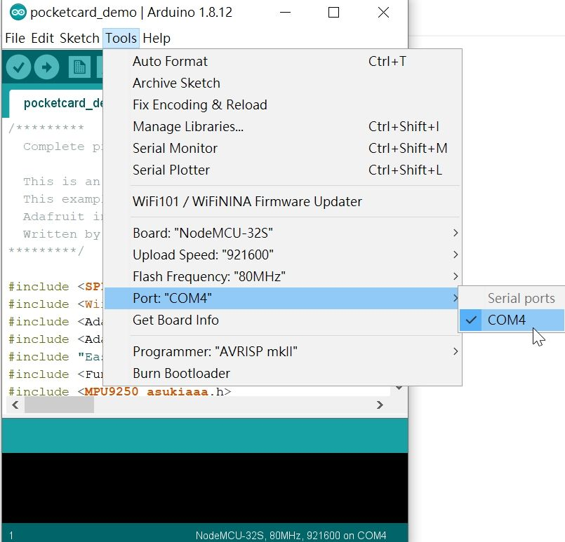

#### 6. 執行 Demo Code

執行範例的 「PocketCard_Demo」

​    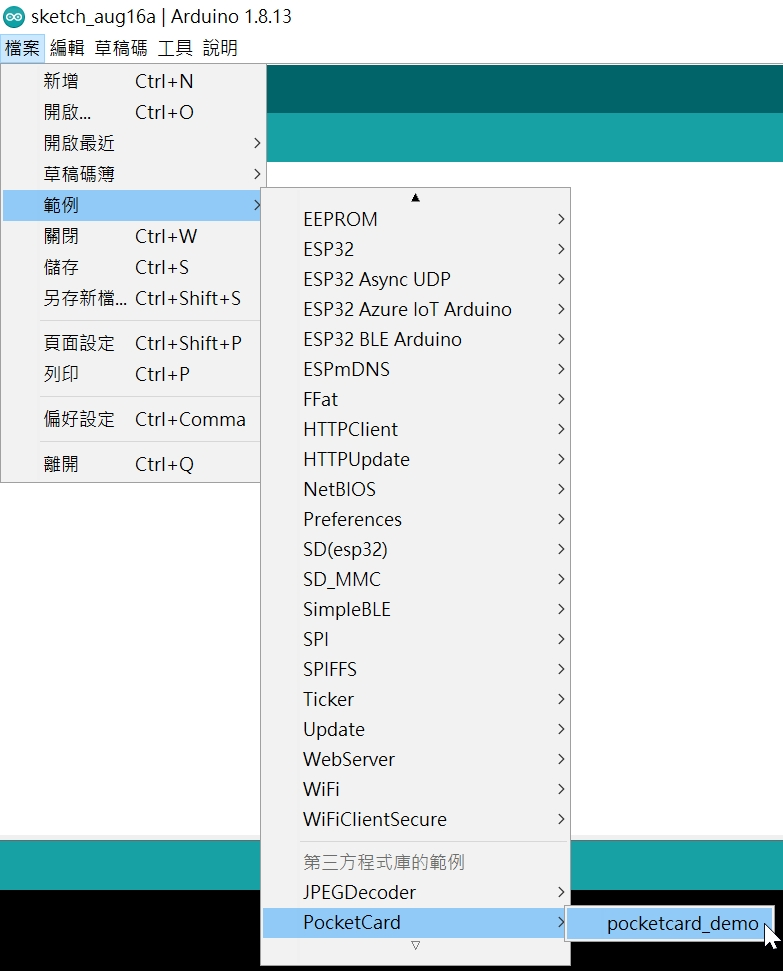

下載成功後，會聽到蜂鳴器響一聲，Oled 面板會出現 “PocketCard HW Test” 

如果是9軸 MPU9250 的版本 ， Oled 面板會出現 “MPU9250” 相關字串 再熄滅

如果是3軸 MSA301 的版本 ， Oled 面板會出現 “MSA301” 相關字串 再熄滅

按A鍵 會出現Light Sensor(A) 和Light Sensor(B ) 和Temperature Sensor 的數值

背面 RGB LED 會依序亮 紅 綠 藍色

   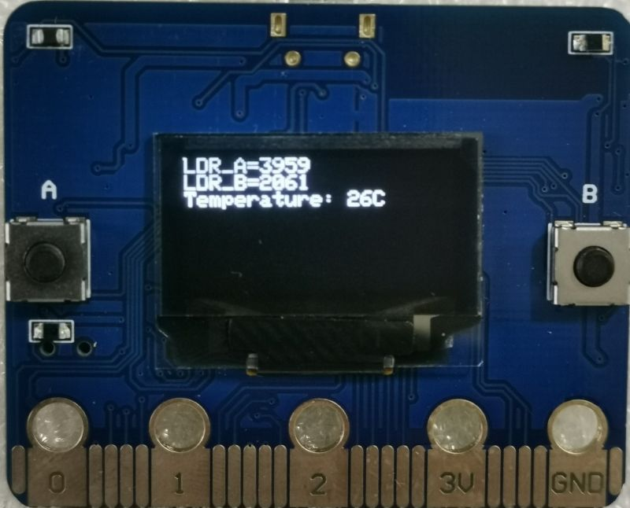

按B鍵 會根據不同主板版本

出現MPU9250 9軸數值

  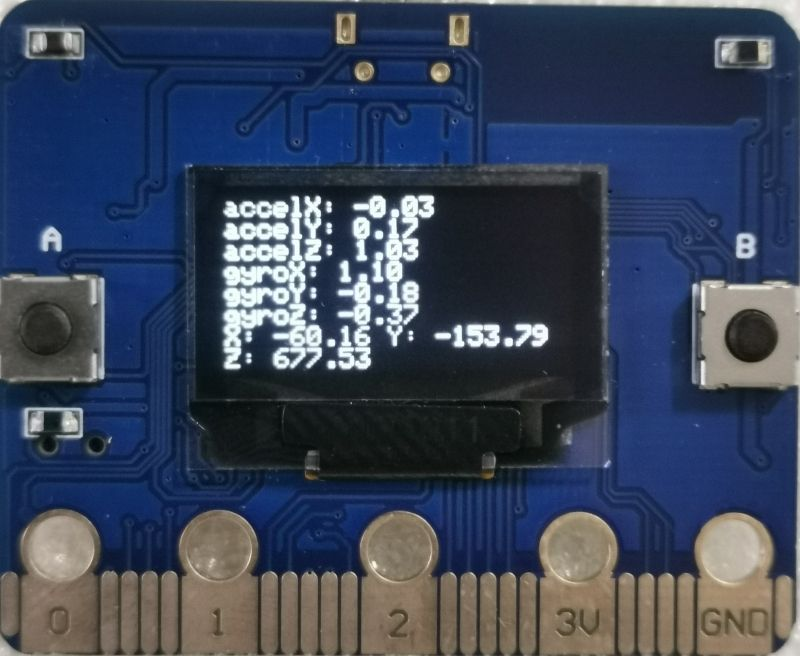

或 MSA301 3軸數值

  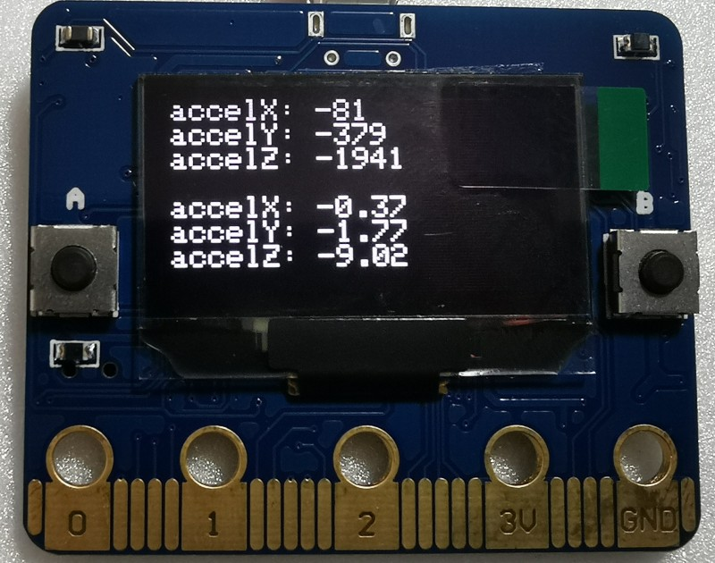