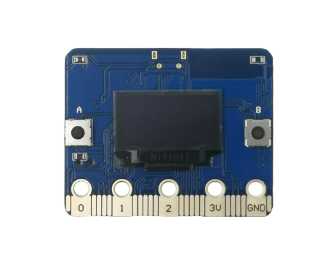
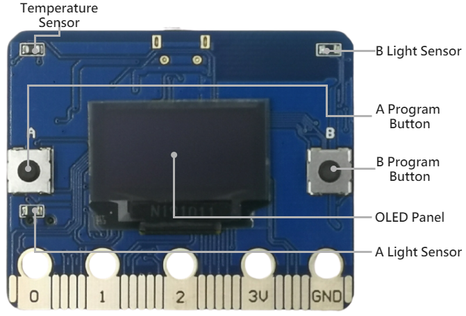
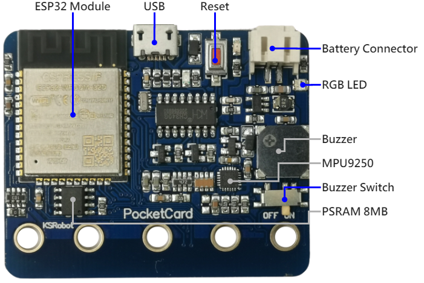
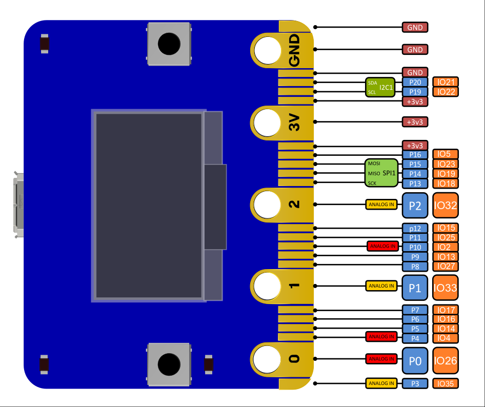

## PocketCard Introduction

PocketCard board is 5 cm x 4 cm in size, it houses a 20-Pin edge connector, built-in 0.96/1.3 in. oled panel, two photosensitive light sensors, two programmable buttons, an ntc thermistor, a buzzer and a **mpu9250 9-axis motion sensor**.

| PocketCard            |                                              |
| --------------------- | -------------------------------------------- |
|CPU    				|  Dual-core 32bit Xtensa LX6, up to 240MHz    |
|RAM    				|  520 KB    |
|ROM   					|    448 KB  |
|Flash	   				| 4096 KB     |
|PSRAM	   				| 8192 KB   (Version2) |
|Bluetooth   			|  Bluetooth v4.2 BR/EDR and BLE    |
|WIFI  					|   802.11 b/g/n/e/i   |
|Panel   				|  0.96 / 1.3 in. oled panel    |
|Photosensitive sensor	| light sensors x2     |
|Temperature sensor   	|    ntc thermistor x1  |
|RGB LED   	| ws2812b x1  (Version2) |
|Button   				|   programmable buttons x2   |
|Buzzer   				|   buzzer x1   |
|Buzzer Switch   		|  buzzer Switch x1    |
|Micro USB   			|     micro USB(for UART) |
|Motion sensor   		|  mpu9250 9-axis motion sensor x1    |
|IO interface   		|   compatible with most micro:bit I/O features   |
|Size   				|   5x4cm   |

## Hardware interface

the I/O space configuration is as follows:

| 主板元件            | ESP32 腳位 |                              |
| -------------------| ------- | ---------------------------- |
| Botton A           | GPIO 14 | Digital Input  |
| Botton B           | GPIO 25 | Digital Input  |
| Light Sensor(A)    | GPIO 39 | Analog Input   |
| Light Sensor(B)    | GPIO 36 | Analog Input   |
| Temperature Sensor | GPIO 34 | Analog Input   |
| Buzzer             | GPIO 26 | PWM            |
| Oled Panel(SCL)    | GPIO 22 | Digital Output |
| Oled Panel(SDA)    | GPIO 21 | Digital Output |
| MPU9250(SCL)       | GPIO 22 | Digital Output |
| MPU9250(SDA)       | GPIO 21 | Digital Output |
| RGB Led            | GPIO 12 | Digital Output |

## PIN definitions

The edge interface is compatible with micro:bit

